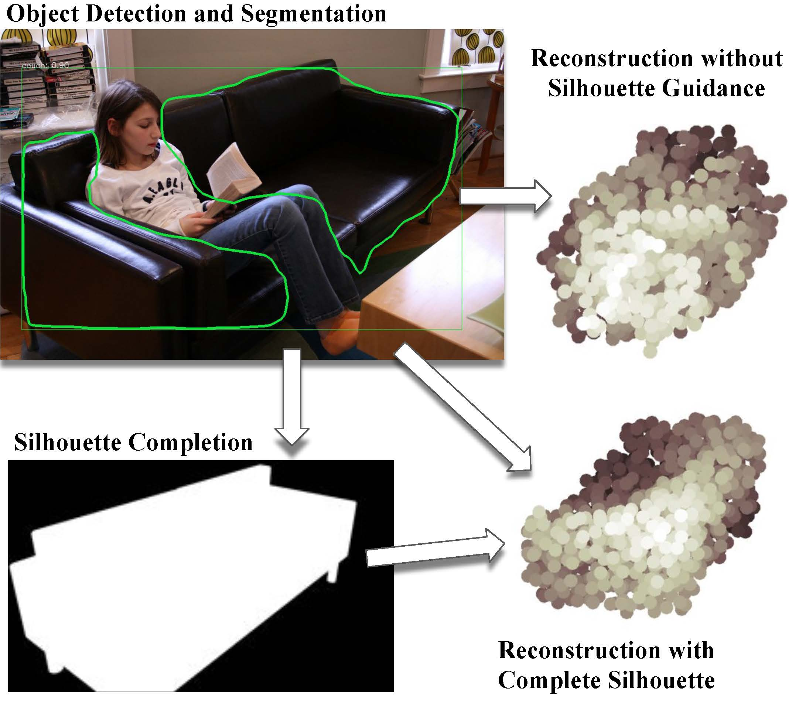
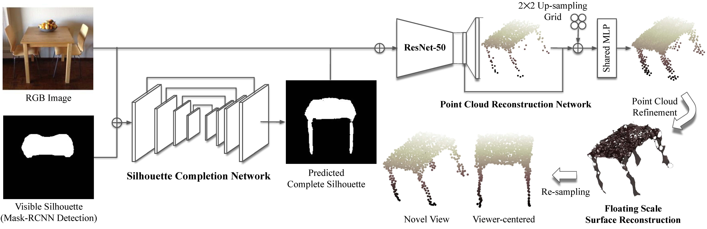

# Silhouette-Guided-3D
PyTorch implementation for [paper](): "Silhouette Guided Point Cloud Reconstruction beyond Occlusion"



Network architecture:



## Requirements
- Python 3
- PyTorch >= 0.4.0
- numpy, scipy, pickle, skimage, sklearn, random, re
- torchvision
- Matlab (for FSSR based post process)

## Installation
- Install [mve](https://github.com/simonfuhrmann/mve) by following the instructions. This is for FSSR based point cloud refinement.
- Under ./matlab folder, install [gptoolbox](https://github.com/alecjacobson/gptoolbox) for Matlab based Poisson-Disc Sampling
- [Optional] Install [Pix3D evaluation toolkit](https://github.com/xingyuansun/pix3d) under the current folder. Note that this requires Tensorflow.
- [Optional] Install [PCN evaluation toolkit](https://github.com/TonythePlaneswalker/pcn) under the current folder. Note that this requires Tensorflow. PCN toolkit is for object-centered evaluation.
- [Optional] Install [Mask-RCNN benchmark](https://github.com/facebookresearch/maskrcnn-benchmark) under the current folder. This is for getting visible silhouette for completion in Pix3D (We've included pre-processed results as below).

## Download Data and Pre-trained Model
- Download [pre-trained models](https://drive.google.com/file/d/1KjmNb1TuIALyiKXNsEQCbp7ow9kP_ENB/view?usp=sharing) and put them under the ./model/ folder.
- Download [pre-processed DYCE dataset](https://drive.google.com/file/d/14sa6p3f-wT1SFL1tZlOPMe63N2dntHEG/view?usp=sharing) and put them under the ./data/ folder.
- Download [pre-processed Pix3D dataset](https://drive.google.com/file/d/1DdcDpePJ-t19SBLRuu0LSK5mNCeB1iUJ/view?usp=sharing) and put them under the ./data/ folder. This includes pre-computed complete silhouette and ground truth point clouds rotated w.r.t. camera position. We've excluded examples with incorrect Mask-RCNN detections.
- Download [ShapeNet dataset](https://drive.google.com/drive/folders/131dH36qXCabym1JjSmEpSQZg4dmZVQid) and put them under the ./data/ folder.
- Download [pre-processed LSUN dataset](https://drive.google.com/file/d/1L7MrNuwYo7-e-adCHJ-S4d4u-_-4JMpS/view?usp=sharing) and put them under the ./data/ folder
- Download [pre-computed result](https://drive.google.com/file/d/103nkDQ5fkJVFV2G9x9FQRSuHByJlKY7q/view?usp=sharing). and put them under the ./result/ folder. This includes point clouds prediction on ShapeNet and Pix3D after FSSR refinement.
- [Optional] Download [ShapeNet rendered images](https://github.com/chrischoy/3D-R2N2), and put them under ./data/ShapeNet/ folder. This is for comparing to object-centered point cloud reconstruction approach.
- [Optional] Download [ShapeNet object-centered point cloud ground truth](https://drive.google.com/file/d/1cfoe521iTgcB_7-g_98GYAqO553W8Y0g/view), , and put them under ./data/ShapeNet/ folder. This is for comparing to object-centered point cloud reconstruction approach.

## Training
- Point cloud reconstruction
    ```
    python train.py
    python test.py
    ```
    This will save network predictions, then for FSSR post-refinement:
    - Start matlab
        ```
        cd matlab
        ./matlab
        ```
    - pre-compute FSSR params (per-pixel normal and scale)
        ```
        FssrPostRefine
        ```
    - FSSR
        Here we provide the sample batch-process code (need to go back to the main folder):
        ```
        cd ..
        python fssr_batch_process.py
        ```
    - smoothing
        ```
        cd matlab
        preComputeFssrParam
        ```

- Silhouette completion
    First train on DYCE dataset:
    ```
    python train_sc.py
    ```
    Then finetune on Pix3D dataset, using 5-fold cross validation ( you will need to run it 5 times by changing the fold number in L32-35 ):
    ```
    python train_sc_ft.py
    python test_sc_pix3d.py
    ```

- Silhouette guidede point cloud reconstruction
    ```
    python train_occ.py
    python test_rec_pix3d.py
    ```
    FSSR post-refinement same as before, change the saved folder to get results

## Evaluation
- Pix3D
    - ICP-based fitting since Pix3D ground truth is object-centered (you can skip this step since we've included pre-computered ground truth and predictions). Code is derived from [3D-LMNET](https://github.com/val-iisc/3d-lmnet), which also includes the ground truth point cloud.
        ```
        cd pcn
        python metrics_pix3d.py
    ```
    - You need to use TensorFlow 3.0+ to run the evaluation:
        ```
        cd pix3d/eval/
        python eval_pix3d.py
        ```
- ShapeNet
    - You need to use TensorFlow 3.0+ to run the evaluation:
        ```
        cd pcn
        python eval_shapenet.py
        ```
    - To compare with object-centered point cloud prediction appraoch ([3D-LMNET](https://github.com/val-iisc/3d-lmnet)), you need to perform ICP-based fitting first:
        ```
        cd pcn
        python metrics_shapenet.py
        cd ../pix3d/eval/
        python eval_shapenet_object_centered.py
        ```
- DYCE (silhouette completion)
    - This is PyTorch based
    ```
    python test_sc_DYCE.py
    ```
